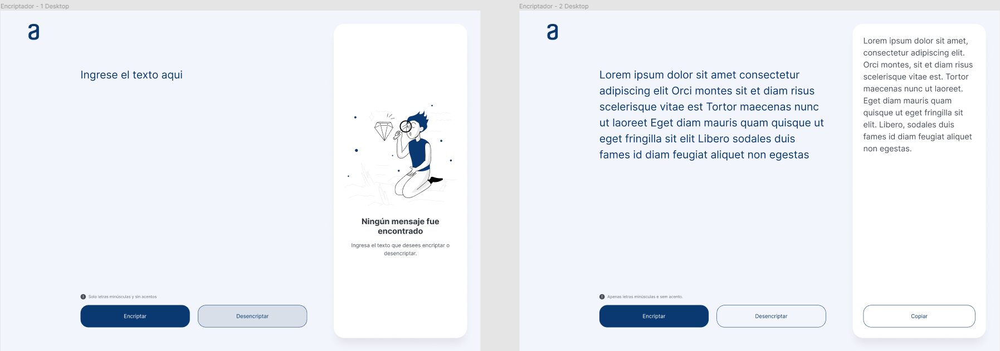
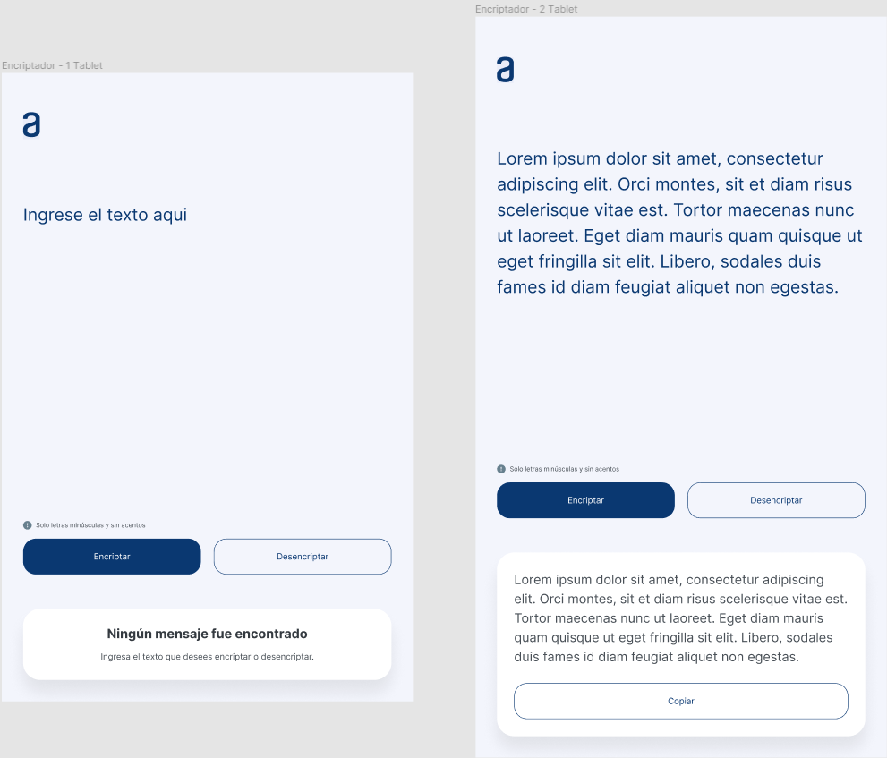
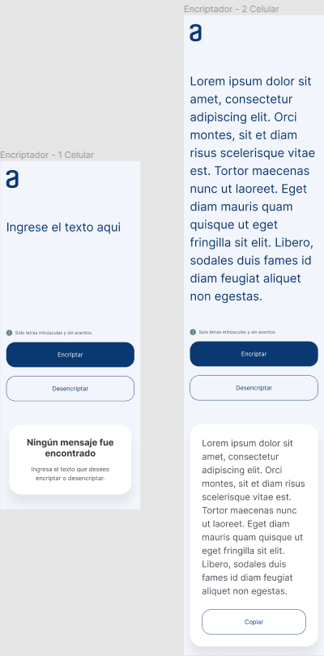

# Desafío encriptador de texto con JavaScript

## **ÍNDICE**

* [1. Intro](README.md#1-intro)
* [2. Qué construí](README.md#2-qué-construí)
* [3. Objetivo del Proyecto](README.md#3-objetivo-del-proyecto)
* [4. Link a Demo](README.md#4-link-a-demo)

****

## 1. Intro

Este proyecto creado para la segunda etapa de OracleONE, es una página web adaptable a dispositivos de distintos tamaños (este tipo de sitio web se conoce en inglés como "responsive").
En este caso se tomaron en consideración 3 tamaños, los cuales se componen por:

Desktop (1440x1024):

Tablet (768x1174):

Mobile (375x933):

## 2. Qué construí

En este proyecto me enfoqué en contruir la interfaz del encriptador basadome en los diseños brindados por el mismo challenge (se pueden apreciar las imágenes en la sección anterior). La página fue dividida en las siguientes secciones:

* **Conversión de texto**: Sección que involucra una sección para introducir el texto que se desea encriptar o desencriptar (según sea el caso), además de dos botones correspondientes a cada acción.

* **Resultado**: Sección de la página donde se puede apreciar el resultado de la conversión del texto (ya sea su encriptación o desencriptación), si el usuario no ha hecho uso de esto se mostrará una imagen con información de que no ha encontrado ningún mensaje para mostrar.

## 3. Objetivo del Proyecto

Implementar los conocimientos obtenidos a lo largo de los cursos brindados por la plataforma de Alura Latam, conocimiento anteriormente obtenido e incluso habilidades de busqueda en otros sitios/plataformas, ésto para encontrar soluciones eficientes para los retos que se presentaron en el desarrollo.

## 4. Link a Demo

Aquí puedes visualizar mi proyecto terminado: [Encriptador de Texto](https://naiviortega.github.io/AluraChallenge_1/)
